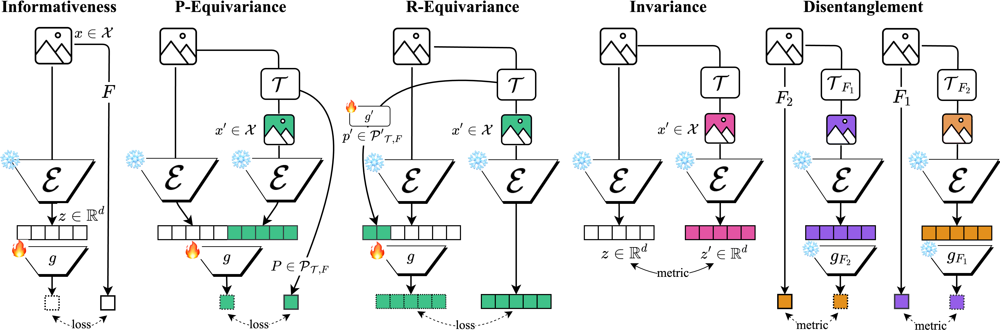

# synesis
Tools for holistic representation evaluation and understanding

*synesis*: unification, to bring (something) together that thereby gives meaning


This is the official repository for the [paper](https://arxiv.org/abs/2505.06224) **Towards a Unified Representation Evaluation Framework Beyond Downstream Tasks**, by Christos Plachouras, Julien Guinot, George Fazekas, Elio Quinton, Emmanouil Benetos, and Johan Pauwels.



## Run
Install the requirements in `requirements.txt`.

Create a symlink to ImagetNet under `data/ImageNet` and LibriSpeech under `data/LibriSpeech`. For example:
```
mkdir data
cd data
ln -s /my/server/datasets/ImageNet
```
Currently, Librispeech `train-clean-100`, `test-clean`, and `dev-clean` are used.

---
### Configuration
* A list of models (used as feature extractors) is available in `config/features.py`. 
* A list of transforms is available in `config/transforms.py`
* Configurations for specific tasks (e.g. downstream setup) can be configured in `config/informativeness` and `config/equivariance`. *Disentanglement* uses the models trained on the *Informativeness* task. *Invariance* does not involve downstram models.


### Informativeness
**Downstream**: Predict factor of variation directly.
```
python -m synesis.informativeness.downstream -f <feature_name> -d <dataset_name> -l <label> (-t <task_name>)
```
### Equivariance
**Parameters**: Predict transformation parameters given two features, one of them being a transformed version of the other.
```
python -m synesis.equivariance.parameters -tf <transform_name> -l <label> -f <feature_name> -d <dataset_name> (-t <task_name>)
```
**Features**: Predict feature of transformed data given original feature and transformation parameters.
```
python -m synesis.equivariance.features -tf <transform_name> -l <label> -f <feature_name> -d <dataset_name> (-t <task_name>)
```
### Invariance
**Covariate shift**: Calculate similarity between features of original and transformed data.
```
python -m synesis.invariance.covariate_shift -tf <transform_name> -f <feature_name> -d <dataset_name> -b <batch_size> -p <dataset_passes>
```
---
### Logging
By default, each task logs artifacts, metrics, and tables to Weights & Biases (WandB). This is to more easily reuse already trained models in other tasks (e.g., a downstream model in invariance). WandB can also be run offline. ``--no-log`` disables WandB logging. However, local logging might be slightly buggy (we'll be testing and fixing this soon).
To log runs to your WandB account, add the environment variables:
```
export WANDB_ENTITY="my-team"
export WANDB_PROJECT="my-project"
```

## Extract features
**Feature extraction** helps speed up downstream training.
```
python -m synesis.extract -f <feature> -d <dataset> (-b <batch_size>)
```


## Develop
We're looking into ways to make contribution simpler, including making it easier to implement new datasets and features. Feel free to raise issues and contact us in the meantime. The process is currently documented below:

### Adding datasets
**Follow the structure of one of the existing datasets.**
1. place under `synesis/datasets/`
2. filename should be lowercase version of class name *(helps make it automatically available to all other components)*

**The necessary `__init__` parameters are:**
1. `feature` (str) which is the name of the feature extractor that is going to be used
2. `root` (str, Path) which should ideally contain a default path
3. `split` Optional[str] which will be `[None, "train", "validation", "test"]`  
4. `feature_config` which overrrides the default config
5. in datasets with variable length items: `itemization`, which is a bool to decide whether to return variable length items or items with equal-length subitems

**The dataset should have the following attributes:**
> consult existing datasets to copy implementations
1. `self.root`
2. `self.raw_data_paths` list of e.g. audio paths
3. `self.feature_paths` e.g. list of embedding paths will be, based on the feature extractor name provided (see example in other datasets)
4. `self.paths` which will be raw_data_paths or feature_paths based on the item_format provided (["raw", "feature"])
5. `self.labels` list of encoded labels
6. `self.label_encoder` which will be either the LaberEncoder or MultiLabelBinarizer from `sklearn`

**Some processes that need to be implemented:**
> consult existing datasets to copy implementations
1. Use default feature config and override with provided one
```python
from config.features import feature_configs

if not feature_config:
    feature_config = feature_configs[feature]
self.feature_config = feature_config
```
2. `__getitem__` should return a raw data item or feature based on self.`item_format`
3. `__getitem__` returns tensors on CPU, unless variable-length-item dataset, in which case if `itemization==True`, item is list of tensor subitems

4. If variable-length-item dataset, `synesis.datasets.dataset_utils.load_track` automatically does this for audio. If it's for other modality, you might need to implement on your own.

### Adding feature extractors (/pretrained models)
**Follow existing feature extractor implementations.**
1. place under `synesis/features/`
2. filename should be lowercase version of class name *(helps make it automatically available to all other components)*
3. if pretrained model, place weights in `models/pretrained/*.pt` with same lowercase name
4. the extractor should have a forward method that deals with batched and channeled data (b, c, feature_dims)
5. ideally, it should return unchanneled data (b, feature_dim)
6. add an entry to `config/features` with the feature name (same as class name) that contains at least `feature_dim`. For now, some adjustments might need to be made for other parameters...

## Cite
```bibtex
@inproceedings{synesis,
    author = {Christos Plachouras and Julien Guinot and George Fazekas and Elio Quinton and Emmanouil Benetos and Johan Pauwels},
    title = {Towards a Unified Representation Evaluation Framework Beyond Downstream Tasks},
    booktitle = {International Joint Conference on Neural Networks (IJCNN)},
    address = {Rome, Italy},
    year = 2025,
}